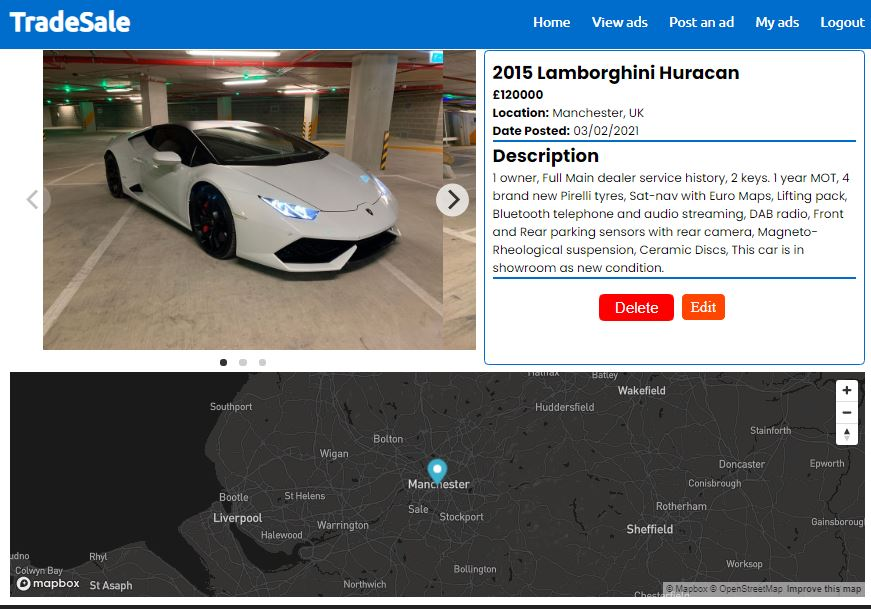
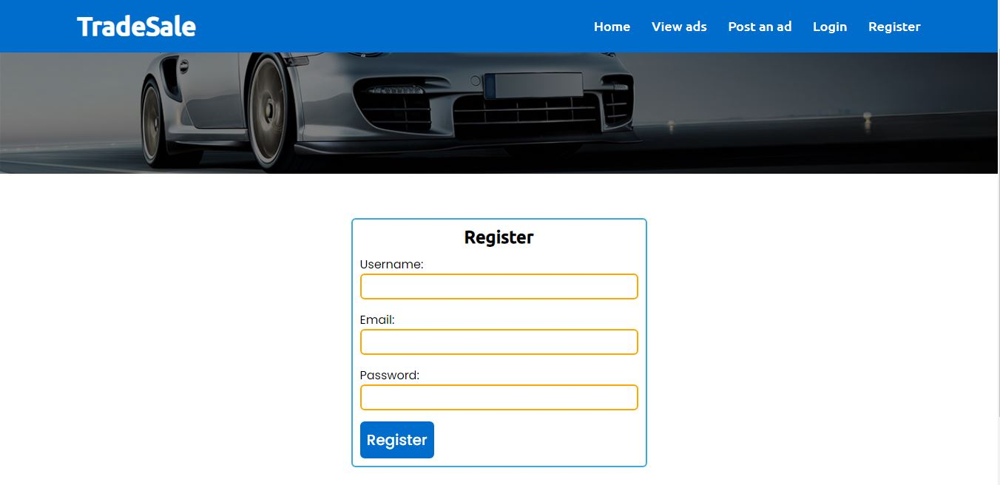
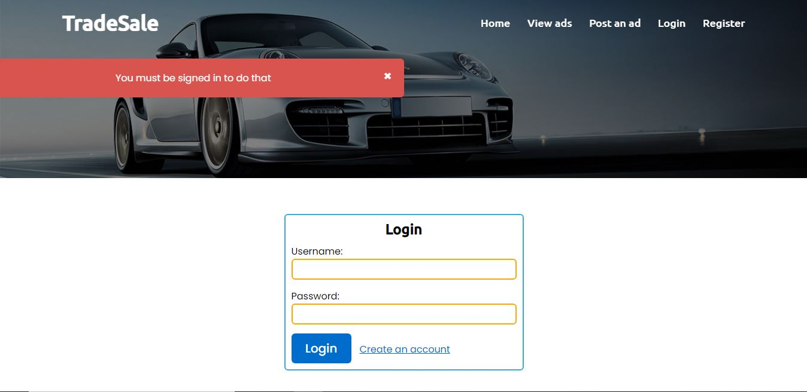
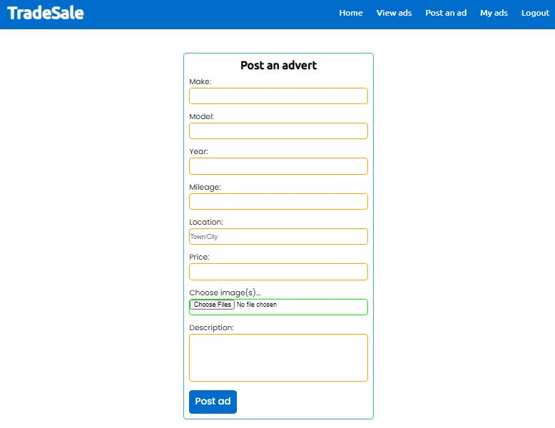

# **TradeSale**
A responsive full-stack webapp built using NodeJs, Express, Mongoose, MongoDB, Passport, EJS, MapBox & Cloudinary.

The webapp features full CRUD operation and user authentication, which allows users to create, read, update and delete adverts. The webapp also features maps and forward Geocoding through MapBox.

## Table of contents
---
* [Demo](#Demo)
* [Site](#Site)
* [Technologies Used](#Technologies%20Used)

## **Demo**
---
Here is a working live demo: https://tradesales.herokuapp.com/

### **Site**
---
**Index Page**

The index page is populated with the most recently posted adverts by accessing the database and finding the latest inserted adverts.

There is a search field on this page which allows you to search by year/make/model and formats your input into regular expression and omits case sensitivity, to find all closest matching adverts.


**Show Page**

This page shows the details of the full details of the advert including the name of the seller & a button which opens up the email client installed on the users device and pre-populates the sellers email address & the subject field of the email with the advert title.

This page also features a map using the MapBox API, with a marker on the sellers location, this is achieved through forward Geocoding using the MapBox API also when the seller posts the advert.



**Index Page**

The index page is populated with the most recently posted adverts by accessing the database and finding the latest inserted adverts.

There is a search field on this page which allows you to search by year/make/model and formats your input into regular expression and omits case sensitivity, to find all closest matching adverts.


**Registration and login**

The registration page takes the username, email address and password, and uses PassportJS to create a new user account and add it to the database after it salts and hashes the password and also gives the user a unique ID.



Routes which require a user to be logged in are protected using custom middleware that validates whether or not the user is logged in.



**Posting ads**

When the seller is posting an ad, the make/model/year inputs are taken and used to create the title of the advert, the inputs are all stored against their own keys in the database.

The location input uses the MapBox Geocoding module for forward Geocoding in order to store the inputted location coordinates as GeoJson data, so that we can access this data later in order to populate the map on the advert page.



**My ads page**

This page shows the logged in user their own adverts by using the users unique id, against the adverts which have the corresponding author id in the database. 


## Technologies Used
---
* [NodeJs](https://nodejs.org/) - Node.js is an open-source, cross-platform, back-end JavaScript runtime environment that runs on the Chrome V8 engine and executes JavaScript code outside a web browser.

* [Express](https://expressjs.com/) - Express.js, or simply Express, is a back end web application framework for Node.js
```bash
npm install express
```
* [MongoDB](https://mongodb.com) - MongoDB is a source-available cross-platform document-oriented database program. Classified as a NoSQL database program, MongoDB uses JSON-like documents with optional schemas. MongoDB is developed by MongoDB Inc. and licensed under the Server Side Public License.
```bash
npm install mongodb
```
* [MapBox](https://mapbox.com) -

The Mapbox Maps Service includes several APIs for creating and requesting maps, either by interacting with an API directly or using an SDK. This includes services for requesting map tiles, requesting static images, uploading data to your Mapbox account, querying data in a tileset, and more.

The Mapbox Search Service includes a single API: the Mapbox Geocoding API. The Mapbox Geocoding API allows you to do forward and reverse geocoding operations.
```bash
npm install @mapbox/mapbox-sdk
```
* [EJS](https://ejs.co/) - EJS is a simple templating language that lets you generate HTML markup with plain JavaScript. 
```bash
npm install ejs
```
* [Passport](http://www.passportjs.org/) - 
Passport is authentication middleware for Node.js. Extremely flexible and modular, Passport can be unobtrusively dropped in to any Express-based web application. A comprehensive set of strategies support authentication using a username and password, Facebook, Twitter, and more.
```bash
npm install passport
npm install passport-local-mongoose
```
* [Cloudinary](https://cloudinary.com/) - 
Cloudinary is a SaaS technology company headquartered in Santa Clara, California, with an office in Israel. The company provides a cloud-based image and video management services. It enables users to upload, store, manage, manipulate, and deliver images and video for websites and apps.
```bash
npm install cloudinary
```
* [Joi](https://github.com/sideway/joi) - 
The most powerful schema description language and data validator for JavaScript.
```bash
npm install joi
```
* [Multer](https://www.npmjs.com/package/multer) - 
Multer is a node.js middleware for handling multipart/form-data, which is primarily used for uploading files. It is written on top of busboy for maximum efficiency.
```bash
npm install multer
npm install multer-storage-cloudinary
```
